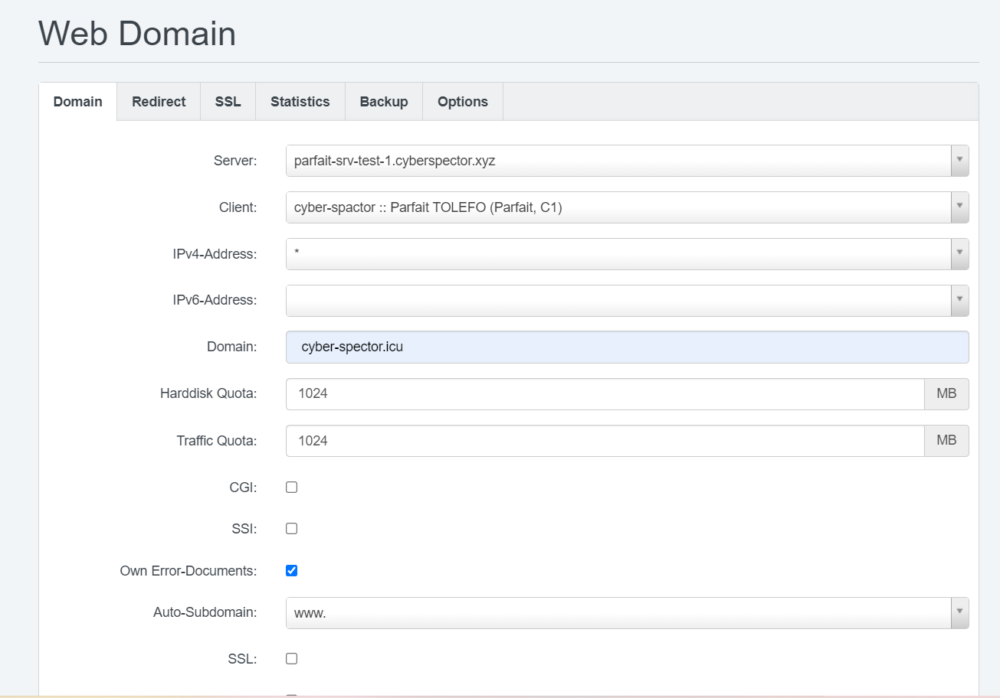
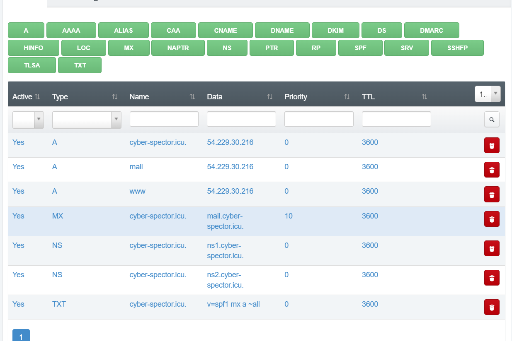
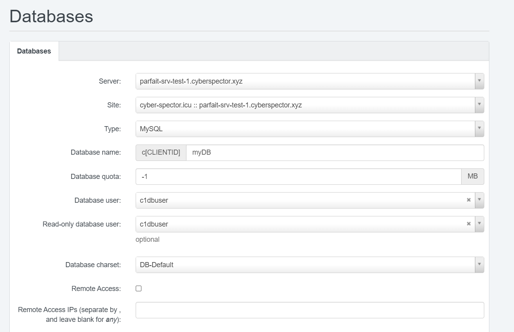

**Tout le travail ici se fera sur le server 1, un server ubuntu**

**Étape 1: Les préliminaires**

- Mettons à jour le système:

`sudo apt-get update && sudo apt-get upgrade`

Dans la suite du travail, nous aurons besoin d'un nom de domaine, nous allons faisons donc une reservation de nom de domaine sur
https://www.freenom.com/fr/index.html

Nous avons reservé le domaine: `cyber-spector.icu`

Pour ISPConfig, nous allons creer un sous domaine `ispconfig.cyber-spector.icu`

- Configurer le nom du server:

`nano /etc/hostname`

    ispconfig.cyber-spector.icu

- Configurer le ficher /etc/hosts

`sudo nano /etc/hosts`

    127.0.0.1 ispconfig.cyber-spector.icu
    127.0.0.1 localhost

- Redémarrons la machine

    `systemctl reboot`

**Étape 2: Exécutons le programme d'installation pour ISPConfig** 

Pour ce travail, nous installerons ISPConfig avec Nginx, PHP (7.4 et 8.0), MariaDB, Postfix, Dovecot, Rspamd, BIND, Jailkit, Roundcube, PHPMyAdmin, Mailman, Webalizer, AWStats et GoAcces.

`wget -O - https://get.ispconfig.org | sh -s -- --use-nginx  --use-php=7.4,8.0 --use-ftp-ports=21-22 --lang=en --no-quota --unattended-upgrades`

_Bravo, nous venons d'installer ISPConfig avec succés_

 _ISPConfig admin password is:_ 
    t5JmG8ewm6DqPUF

 _MySQL root password is:_ 
    DshWXBXZpxMULVq939qn

On peut accéder à l'interface web de IPSConfig sur le port 8080 ==> https://parfait-srv-test-1.cyberspector.xyz:8080/

c
- Changeons le mot de passe prcédent dans `tools`

Le nouveau mot de passe est: 
    
    S0M0r3@S3cur3d==

_En production, il faut definir le 2FA !!!_

- Configurons le firewall sous l'onglet `Systeme`

_Prenons le soin de ne listons que les ports néccéssaire pour etre ouvert_

Réfférence: [hetzner community](https://community.hetzner.com/tutorials/how-to-install-ispconfig-on-ubuntu-20-04-lts)

**Étape 3: Mise en place du DNS** 

- Installation des packages

    sudo apt update 
    sudo apt install bind9 -y 

- Création d'un fichier de zone de transfert

`sudo nano /etc/bind/cyber-spector.icu.zone`

    
    ; Forward Zone file for cyber-spector.icu
    $TTL 14400
    @      86400    IN      SOA     ns1.cyber-spector.icu. webmaster.cyber-spector.icu. (
                    3013040200      ; serial, todays date+todays
                    86400           ; refresh, seconds
                    7200            ; retry, seconds
                    3600000         ; expire, seconds
                    86400           ; minimum, seconds
        )
    ns1             IN A 54.229.30.216
    ns2             IN A 54.229.30.216
    cyber-spector.icu.   86400  IN        NS      ns1.cyber-spector.icu.
    cyber-spector.icu.   86400  IN        NS      ns2.cyber-spector.icu.
    cyber-spector.icu.          IN        A       54.229.30.216
    www                   IN        CNAME   cyber-spector.icu.
    @   IN   MX   10   mail.cyber-spector.icu.

- Verifions l'état de la configuration

     sudo named-checkzone cyber-spector.icu /etc/bind/cyber-spector.icu.zone
 

- Mise à jour la configuration principale de Bind9

    zone "cyber-spector.icu" IN {
            type master;
            file "/etc/bind/cyber-spector.icu.zone";
    };

- Enregistrons le fichier et vérifions les fichiers de configuration :

    named-checkconf  /etc/bind/named.conf.local 
    named-checkconf  /etc/bind/named.conf 

- Redémarrons le service bind9

    sudo systemctl restart bind9 
    sudo systemctl status bind9 

- Tests 

Bind9 tourne bien !!!

- Création d'un Client

    

_Password_

    MB!49ean

- Ajout d'un domaine web

- Ajout de Zone dns 

- Ajout de domaine de mail

- Ajout de boite de mail

    webmaster@cyber-spector.icu

    tG9bEqC_

