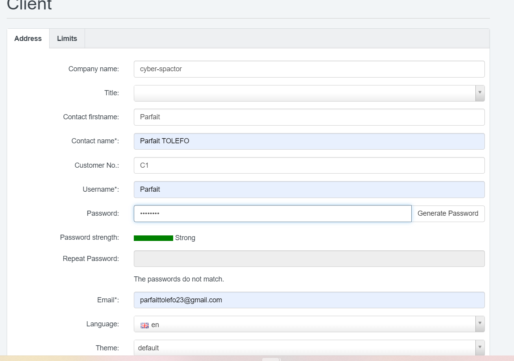

**Tout le travail ici se fera sur le server 1, un server ubuntu**

**Étape 1: Les préliminaires**

- Mettons à jour le système:

`sudo apt-get update && sudo apt-get upgrade`

Dans la suite du travail, nous aurons besoin d'un nom de domaine, nous allons faisons donc une reservation de nom de domaine sur
https://www.freenom.com/fr/index.html

Nous avons reservé le domaine: `cyber-spector.icu`

Pour ISPConfig, nous allons creer un sous domaine `ispconfig.cyber-spector.icu`

- Configurer le nom du server:

`nano /etc/hostname`

    ispconfig.cyber-spector.icu

- Configurer le ficher /etc/hosts

`sudo nano /etc/hosts`

    127.0.0.1 ispconfig.cyber-spector.icu
    127.0.0.1 localhost

- Redémarrez la machine

    `systemctl reboot`

**Étape 2: Exécutons le programme d'installation pour ISPConfig** 

Pour ce travail, nous installerons ISPConfig avec Nginx, PHP (7.4 et 8.0), MariaDB, Postfix, Dovecot, Rspamd, BIND, Jailkit, Roundcube, PHPMyAdmin, Mailman, Webalizer, AWStats et GoAcces.

`wget -O - https://get.ispconfig.org | sh -s -- --use-nginx  --use-php=7.4,8.0 --use-ftp-ports=21-22 --lang=en --no-quota --unattended-upgrades`

_Bravo, nous venons d'installer ISPConfig avec succés_

 _ISPConfig admin password is:_ t5JmG8ewm6DqPUF

 _MySQL root password is:_ DshWXBXZpxMULVq939qn

On peut accéder à l'interface web de IPSConfig sur le port 8080 ==> https://parfait-srv-test-1.cyberspector.xyz:8080/

**Étape 4: Mettre en pratiques les bonnes pratique de securité sur IPSConfig**

- Changeons le mot de passe prcédent dans `tools`

Le nouveau mot de passe est: 
    
    S0M0r3@S3cur3d==

_En production, il faut definir le 2FA !!!_

- Configurons le firewall sous l'onglet `Systeme`

_Prenez le soin de ne listez que les ports néccéssaire pour etre ouvert_

Réfférence: [hetzner community](https://community.hetzner.com/tutorials/how-to-install-ispconfig-on-ubuntu-20-04-lts)