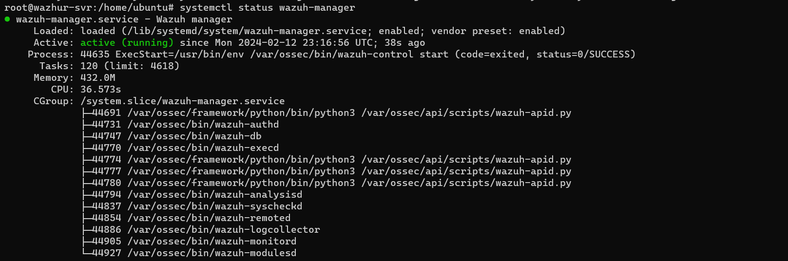

**Le principal travail ici se fera sur le server 2, un server ubuntu**

**Étape 1: Les préliminaires**

- Mettons à jour le système:

`sudo apt-get update && sudo apt-get upgrade`

- Configurez le nom du server

`sudo nano /etc/hostname`
     
    wazhur-svr.cyber-spector.icu

`sudo nano /etc/hosts`

    127.0.0.1 wazhur-svr.cyber-spector.icu
    127.0.0.1 localhost

- Redémarrez la machine

    `systemctl reboot`

**Étape 2: Exécutons l'installation de Wazuh** 

Nous somme en mode **root** pour faciliter les installations

- Installons les packages suivants s'ils sont manquants

`apt-get install gnupg apt-transport-https`

- Installons la clé GPG

`curl -s https://packages.wazuh.com/key/GPG-KEY-WAZUH | gpg --no-default-keyring --keyring gnupg-ring:/usr/share/keyrings/wazuh.gpg --import && chmod 644 /usr/share/keyrings/wazuh.gpg`

- Ajoutons le référentiel.

`echo "deb [signed-by=/usr/share/keyrings/wazuh.gpg] https://packages.wazuh.com/4.x/apt/ stable main" | tee -a /etc/apt/sources.list.d/wazuh.list`

- Mettons à jour les informations sur les packages

`apt-get update`

- Installation du gestionnaire Wazuh

`apt-get -y install wazuh-manager`

- Activons et démarrons le service de gestion Wazuh

    systemctl daemon-reload
    systemctl enable wazuh-manager
    systemctl start wazuh-manager

- Vérification du service Wazuh

    `systemctl status wazuh-manager`

Bingo !!! Wazuh is runing well

- Installation de Filebeat

`apt-get -y install filebeat`

Réfférence: [documentation wazuh](https://documentation.wazuh.com/current/installation-guide/wazuh-server/step-by-step.html)
