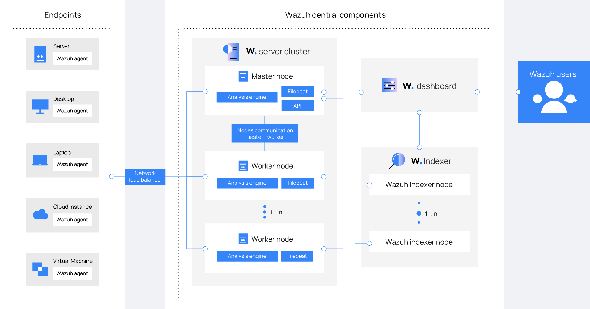
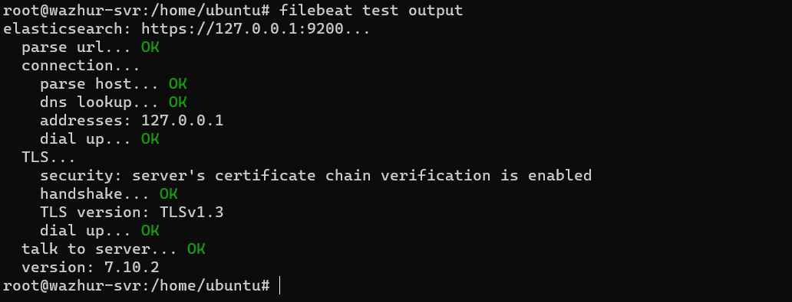

**Le principal travail ici se fera sur le server 2, un server ubuntu**

**Étape 1: Les préliminaires**

- Mettons à jour le système:

`sudo apt-get update && sudo apt-get upgrade`

- Configurons le nom du server

`sudo nano /etc/hostname`
     
    wazhur-svr.cyber-spector.icu

`sudo nano /etc/hosts`

    127.0.0.1 wazhur-svr.cyber-spector.icu
    127.0.0.1 localhost

- Redémarrons la machine

    `systemctl reboot`

**Étape 2: Exécutons l'installation de Wazuh server** 

Nous somme en mode **root** pour faciliter les installations

- Installons les packages suivants s'ils sont manquants

`apt-get install gnupg apt-transport-https`

- Installons la clé GPG

`curl -s https://packages.wazuh.com/key/GPG-KEY-WAZUH | gpg --no-default-keyring --keyring gnupg-ring:/usr/share/keyrings/wazuh.gpg --import && chmod 644 /usr/share/keyrings/wazuh.gpg`

- Ajoutons le référentiel.

`echo "deb [signed-by=/usr/share/keyrings/wazuh.gpg] https://packages.wazuh.com/4.x/apt/ stable main" | tee -a /etc/apt/sources.list.d/wazuh.list`

- Mettons à jour les informations sur les packages

`apt-get update`

- Installation du gestionnaire Wazuh

`apt-get -y install wazuh-manager`

- Activons et démarrons le service de gestion Wazuh

    systemctl daemon-reload
    systemctl enable wazuh-manager
    systemctl start wazuh-manager

- Vérification du service Wazuh

    `systemctl status wazuh-manager`

Bingo !!! Wazuh is runing well

- Installation de Filebeat

`apt-get -y install filebeat`

-  **Configuration de Filebeat**

1. Téléchargons le fichier de configuration Filebeat préconfiguré.

`curl -so /etc/filebeat/filebeat.yml https://packages.wazuh.com/4.7/tpl/wazuh/filebeat/filebeat.yml`

2. Modification du fichier de configuration /etc/filebeat/filebeat.yml selon l'architecture

Dans notre car, nous ne changeons rien car l'indexeur sera installer sur le meme serveur ci

 3. Créez un magasin de clés Filebeat pour stocker en toute sécurité les informations d'authentification

`filebeat keystore create`

4. Ajout du nom d'utilisateur et du mot de passe par défaut `admin : admin` au magasin de clés secrets.

    echo admin | filebeat keystore add username --stdin --force
    echo admin | filebeat keystore add password --stdin --force

5. Téléchargez le modèle d'alertes pour l'indexeur Wazuh

    curl -so /etc/filebeat/wazuh-template.json https://raw.githubusercontent.com/wazuh/wazuh/v4.7.2/extensions/elasticsearch/7.x/wazuh-template.json
    chmod go+r /etc/filebeat/wazuh-template.json
    
6. Installez le module Wazuh pour Filebeat

`curl -s https://packages.wazuh.com/4.x/filebeat/wazuh-filebeat-0.3.tar.gz | tar -xvz -C /usr/share/filebeat/module`

7. Création des certificats

    NODE_NAME=wazuh-1
    mkdir /etc/filebeat/certs
    tar -xf ./wazuh-certificates.tar -C /etc/filebeat/certs/ ./$NODE_NAME.pem ./$NODE_NAME-key.pem ./root-ca.pem
    mv -n /etc/filebeat/certs/$NODE_NAME.pem /etc/filebeat/certs/filebeat.pem
    mv -n /etc/filebeat/certs/$NODE_NAME-key.pem /etc/filebeat/certs/filebeat-key.pem
    chmod 500 /etc/filebeat/certs
    chmod 400 /etc/filebeat/certs/*
    chown -R root:root /etc/filebeat/certs

8. Démarrage du service Filebeat

    systemctl daemon-reload
    systemctl enable filebeat
    systemctl start filebeat

9. Test de filebeat

Bingo !!! 

**Étape 2: Installation de Wazuh indexer**

- Création des certificats

    curl -sO https://packages.wazuh.com/4.7/wazuh-certs-tool.sh
    curl -sO https://packages.wazuh.com/4.7/config.yml

- Configuration du fichier config.yml

Dans notre cas, tous les composants sont sur la même machine

- Créer les certificats

`bash ./wazuh-certs-tool.sh -A`

- Compressez tous les fichiers nécessaires

    tar -cvf ./wazuh-certificates.tar -C ./wazuh-certificates/ .
    rm -rf ./wazuh-certificates

- Installons de l'indexeur Wazuh

`apt-get -y install wazuh-indexer`

- Déploiement de certificats

    NODE_NAME=node-1
    mkdir /etc/wazuh-indexer/certs
    tar -xf ./wazuh-certificates.tar -C /etc/wazuh-indexer/certs/ ./$NODE_NAME.pem ./$NODE_NAME-key.pem ./admin.pem ./admin-key.pem ./root-ca.pem
    mv -n /etc/wazuh-indexer/certs/$NODE_NAME.pem /etc/wazuh-indexer/certs/indexer.pem
    mv -n /etc/wazuh-indexer/certs/$NODE_NAME-key.pem /etc/wazuh-indexer/certs/indexer-key.pem
    chmod 500 /etc/wazuh-indexer/certs
    chmod 400 /etc/wazuh-indexer/certs/*
    chown -R wazuh-indexer:wazuh-indexer /etc/wazuh-indexer/certs

- Starting the service

    systemctl daemon-reload
    systemctl enable wazuh-indexer
    systemctl start wazuh-indexer
    systemctl status wazuh-indexer

- Initialisation du cluster
`/usr/share/wazuh-indexer/bin/indexer-security-init.sh`

- Test de l'installation du cluster
`curl -k -u admin:admin https://127.0.0.1:9200`

Very good, everything is well !!! 

**Étape 2: Installation de wazuh-dashboard**

- Installation des dépendances du package
 
 `apt-get install debhelper tar curl libcap2-bin #debhelper version 9 or later`

- Ajout du référentiel Wazuh

 1. Installez la clé GPG.

    curl -s https://packages.wazuh.com/key/GPG-KEY-WAZUH | gpg --no-default-keyring --keyring gnupg-ring:/usr/share/keyrings/wazuh.gpg --import && chmod 644 /usr/share/keyrings/wazuh.gpg

    echo "deb [signed-by=/usr/share/keyrings/wazuh.gpg] https://packages.wazuh.com/4.x/apt/ stable main" | tee -a /etc/apt/sources.list.d/wazuh.list
    
    apt-get update

- Installater le tableau de bord Wazuh

`apt-get -y install wazuh-dashboard`

- Configuration du tableau de bord Wazuh

- Déploiement de certificats

    NODE_NAME=dashboard
    mkdir /etc/wazuh-dashboard/certs
    tar -xf ./wazuh-certificates.tar -C /etc/wazuh-dashboard/certs/ ./$NODE_NAME.pem ./$NODE_NAME-key.pem ./root-ca.pem
    mv -n /etc/wazuh-dashboard/certs/$NODE_NAME.pem /etc/wazuh-dashboard/certs/dashboard.pem
    mv -n /etc/wazuh-dashboard/certs/$NODE_NAME-key.pem /etc/wazuh-dashboard/certs/dashboard-key.pem
    chmod 500 /etc/wazuh-dashboard/certs
    chmod 400 /etc/wazuh-dashboard/certs/*
    chown -R wazuh-dashboard:wazuh-dashboard /etc/wazuh-dashboard/certs

-Démarrage du service de tableau de bord Wazuh

    systemctl daemon-reload
    systemctl enable wazuh-dashboard
    systemctl start wazuh-dashboard
    systemctl status wazuh-dashboard

Bingo !!!

- Sécurisons   Wazuh

_Changeons le mot de passe_

`/usr/share/wazuh-indexer/plugins/opensearch-security/tools/wazuh-passwords-tool.sh --change-all --admin-user wazuh --admin-password wazuh`

_Output_

    root@wazhur-svr:/home/ubuntu# /usr/share/wazuh-indexer/plugins/opensearch-security/tools/wazuh-passwords-tool.sh --change-all --admin-user wazuh --admin-password wazuh
    13/02/2024 14:02:57 INFO: The password for user admin is pmxDoyil59F?dZsfo9WdR9ueLiTl?w*T
    13/02/2024 14:02:57 INFO: The password for user kibanaserver is MbjYEPxEfxS2WxkFD??5NuRpaqnlYIpJ
    13/02/2024 14:02:57 INFO: The password for user kibanaro is +MSbI8RQ42AuwBJy65GFb6QO7IQARp.i
    13/02/2024 14:02:57 INFO: The password for user logstash is kHCYAuMqE9w?ggjiPiriX4+h.FYaPWo?
    13/02/2024 14:02:57 INFO: The password for user readall is wDHRgdfGcGee33D2cys0.z9xm2STM7xg
    13/02/2024 14:02:57 INFO: The password for user snapshotrestore is kK3hZbx5K7C5xJ++q+SDPfi3I2+7cm4.
    13/02/2024 14:02:57 WARNING: Wazuh indexer passwords changed. Remember to update the password in the Wazuh dashboard and Filebeat nodes if necessary, and restart the services.
    13/02/2024 14:03:00 INFO: The password for Wazuh API user wazuh is dnA*.B1UjsEyuySGIwzo016pOE?e50sD
    13/02/2024 14:03:01 INFO: The password for Wazuh API user wazuh-wui is *3UZgBGXjKV.xuvruYOrP3h2PB24n47z
    13/02/2024 14:03:01 INFO: Updated wazuh-wui user password in wazuh dashboard. Remember to restart the service.

Réfférence: [documentation wazuh](https://documentation.wazuh.com/current/installation-guide/wazuh-server/step-by-step.html)

**La presente section est dédié à l'integration de wazuh a monitorer le serveur 1**

**Retour sur le serveur 1**

- Ajouter le référentiel Wazuh

    curl -s https://packages.wazuh.com/key/GPG-KEY-WAZUH | gpg --no-default-keyring --keyring gnupg-ring:/usr/share/keyrings/wazuh.gpg --import && chmod 644 /usr/share/keyrings/wazuh.gpg

    echo "deb [signed-by=/usr/share/keyrings/wazuh.gpg] https://packages.wazuh.com/4.x/apt/ stable main" | tee -a /etc/apt/sources.list.d/wazuh.list

    apt-get update

- Déployer un agent Wazuh

    WAZUH_MANAGER="parfait-srv-test-2.cyberspector.xyz" WAZUH_MANAGER_PORT='1514' apt-get install wazuh-agent

- Activez et démarrez le service d'agent Wazuh.

    systemctl daemon-reload
    systemctl enable wazuh-agent
    systemctl start wazuh-agent

- Verifions le statut

    systemctl status wazuh-agent

- Action recommandée : Désactiver les mises à jour Wazuh

    sed -i "s/^deb/#deb/" /etc/apt/sources.list.d/wazuh.list
    apt-get update

    echo "wazuh-agent hold" | dpkg --set-selections

